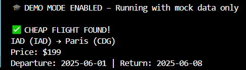

# ✈️ Flight Deal Finder

A real-world Python automation project that scans live flight prices using the Amadeus API, checks them against user-defined budgets, and sends email alerts if prices drop below the threshold. Google Sheets (via the Sheety API) serves as a lightweight backend for managing destination data.

The project supports **DEMO MODE** so recruiters can test the functionality **without any setup or API keys**. Code is modular, clean, and structured for production-level readability.

---

## 🚀 Demo Mode Included

Recruiters or reviewers can run the app **without setting up any API keys** by enabling demo mode in `main.py`:

```python
DEMO_MODE = True
```

This will print a realistic mock flight deal with no external dependencies.

> ✅ Perfect for showcasing the project without any setup friction.

---

## 🖥️ Screenshot



---

## 🔧 Features

- ✅ Real-time flight search via Amadeus API
- ✅ Automated price comparison to user-defined max prices
- ✅ Email alerts for budget-friendly flight deals
- ✅ Google Sheets integration (Sheety API)
- ✅ DEMO_MODE for easy review/testing
- ✅ Secure use of `.env` file for credentials
- ✅ Clean, modular Python architecture

---

## 🛠 Tech Stack

- **Language:** Python 3  
- **APIs:** Amadeus Flights API, Sheety API (Google Sheets)  
- **Email:** Gmail SMTP (via `smtplib`)  
- **Environment Variables:** Managed with `python-dotenv`  
- **Dependency Management:** `requirements.txt`  
- **Architecture:** OOP, modular scripts per concern

---

## 📂 Project Structure

```
flight-deal-finder/
│
├── main.py                  # App entry point – includes DEMO_MODE
├── flight_data.py           # Data class for storing flight info
├── flight_search.py         # Searches for flights via Amadeus API
├── data_manager.py          # Reads/writes to Google Sheets (Sheety)
├── notification_manager.py  # Sends deal alerts via email
├── .env.example             # Template for environment variables
├── .gitignore               # Ignores .env, __pycache__, etc.
├── requirements.txt         # Python dependencies
└── media/screenshots/       # Demo screenshot folder
```

---

## 🔒 Environment Variables

Create a `.env` file using `.env.example` as a reference:

```env
SHEET_ENDPOINT=https://api.sheety.co/YOUR_ENDPOINT_HERE
AMADEUS_CLIENT_ID=YOUR_AMADEUS_CLIENT_ID
AMADEUS_CLIENT_SECRET=YOUR_AMADEUS_CLIENT_SECRET
MY_EMAIL=YOUR_EMAIL_ADDRESS@gmail.com
MY_EMAIL_PASSWORD=YOUR_APP_PASSWORD
```

---

## 📧 Email Alerts

When a cheap flight is found, the email alert looks like this:

```
Subject: ✈️ Low price alert! Only $199 to Paris

Cheap flight found!

IAD (IAD) → Paris (CDG)
Price: $199
Departure: 2025-06-01 | Return: 2025-06-08
```

---

## 🧪 How to Run

1. Clone the repository:
```bash
git clone https://github.com/Cyber-Security-Tech/flight-deal-finder.git
cd flight-deal-finder
```

2. Install dependencies:
```bash
pip install -r requirements.txt
```

3. Add a `.env` file with your API credentials (or leave `DEMO_MODE = True`)

4. Run the app:
```bash
python main.py
```

---

## 💡 What I Learned

- Integrating multiple APIs (Amadeus, Sheety)
- Structuring Python projects with clean OOP patterns
- Using environment variables securely
- Building lightweight automation with real-world use cases
- Making portfolio-ready projects that are also recruiter-friendly

---

## 🔮 Future Improvements

- Add user input support for selecting origin cities
- Schedule automatic daily scans and notifications
- Export found deals to a CSV or Google Sheet log
- Support multiple users with personalized flight preferences
- Add SMS alerts via Twilio or Telegram

---

## 👀 Why This Project Matters

This project shows more than just Python knowledge:

- ✅ Real-world API integration
- ✅ Automated systems & alert logic
- ✅ Secure architecture and clean code
- ✅ Practical utility beyond tutorials

It’s designed to **demonstrate professional software practices** while remaining easy for recruiters and reviewers to test.
